<!--
ANLEITUNG FÜR DAS CLAUDE-POWERPOINT-ADDIN
- Jeder mit `---` getrennte Block ist EINE Folie. Die erste `#`/`##`-Zeile ist der Folientitel.
- Bilder liegen unter `infographics/` (16:9, schon mit Marken-Header). Pro Bildfolie das Bild gross/formatfüllend platzieren, Bulletpunkte daneben oder darunter klein.
- `> Speaker:`-Zeilen sind Sprechernotizen (in die Notizen der Folie, nicht auf die Folie).
- ```mermaid```-Blöcke als Diagramm rendern (oder durch das gleichnamige SVG ersetzen).
- Sprache: Deutsch. Stil: ruhig, technisch, viel Weissraum. Marke: Matthias Falland (Rot/Navy).
-->

# Agentic Architecture
## From Chat to ralph

**Matthias Falland** — Microsoft Data Platform MVP
Techconference Wien 2026 · Workshop · Level 200–300

> Speaker: Willkommen. Kein Hype. Wir verstehen erst die Schichten — LLM, MCP, Agent, Autonomie — und bauen dann an einer echten Enterprise-Azure-Architektur. Kernfrage des Tages: nicht „wie hoch klettere ich", sondern „welche Stufe verlangt die Aufgabe".

---

# Wer bin ich

**Matthias Falland** — Microsoft **MVP Data Platform** (seit 2018) · MCT seit 2009

- **20 Jahre** Microsoft Data Platform: SQL Server 2005 → **Microsoft Fabric** 2025
- **20+ Enterprise-Implementierungen** — Architektur-Patterns aus der Praxis
- Microsoft **Fabric Influencers Spotlight** (2025) · **FABCON 2026** Speaker
- **Fabric Friday** (YouTube @TheTrustedAdvisor) · copilot-cockpit.com

> Speaker: 60 Sekunden. Glaubwürdigkeit für DIESEN Talk: Architektur-Patterns aus 20+ Implementierungen — und ich fahre agentische Methoden (ralplan/ralph) selbst produktiv. Kein Theoretiker.

---

# Der rote Faden

> Die meisten Architektur-Fragen sind auf **Stufe 2–3** beantwortet.
> Nur **offene, prüfintensive** Aufgaben rechtfertigen Multi-Agent und Autonomie.

- Heute: erst **erklären** (LLM → MCP → Agent → Multi-Agent → Verifizierung → Autonomie)
- dann **zeigen**: dieselbe Azure-Aufgabe mit zunehmend reiferen Methoden
- und ehrlich: **wann sogar gar kein Agent** die beste Antwort ist

> Speaker: Das ist der Vertrag mit dem Publikum. Am Ende haben sie einen Entscheidungsbaum, kein Hype-Gefühl.

---

# Mitmachen — Repo & Setup


**github.com/TheTrustedAdvisor/agentic-azure-techconf-wien-2026**

```bash
git clone https://github.com/TheTrustedAdvisor/agentic-azure-techconf-wien-2026
cd agentic-azure-techconf-wien-2026
./setup.sh                 # einmal: isoliertes Config + Login
cd 01-chat && ./run.sh     # los geht's
```

> Speaker: JETZT scannen und klonen — das Setup läuft im Hintergrund, während wir die Grundlagen machen. Repo ist öffentlich, alles zum Mitnehmen und Selber-Bauen. QR-Bild: `presentation/qr-repo.png`.

---

# Teil A — Grundlagen

> Speaker: Überleitung. Bevor wir bauen, müssen alle dieselbe Mechanik im Kopf haben. Sieben kurze Konzept-Folien.

---

# Was ist ein LLM?

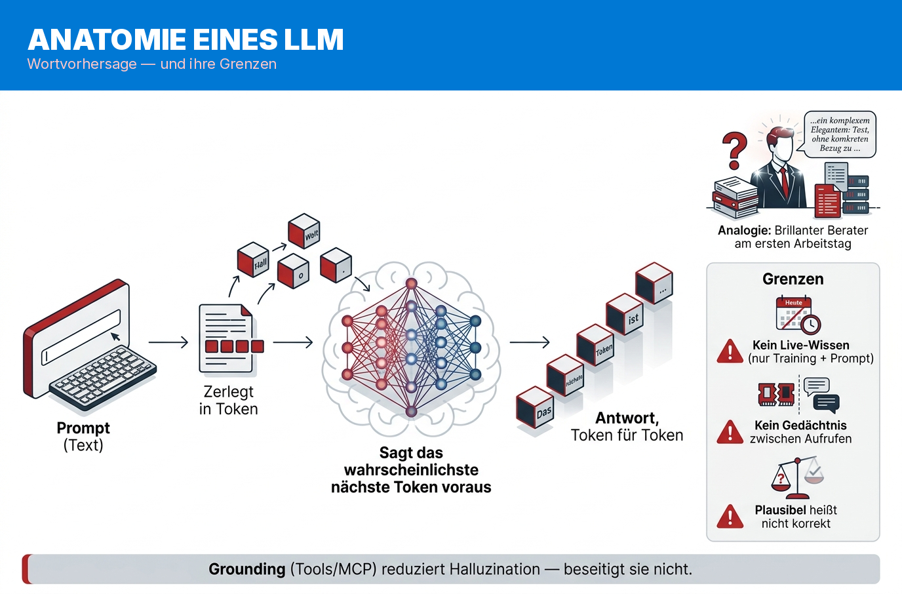

- sagt das **nächste Token** voraus — optimiert auf *Plausibilität*, nicht *Wahrheit*
- kein Live-Wissen, kein Gedächtnis, keine Aktionen
- **Grounding senkt Halluzination — beseitigt sie nicht**

> Speaker: „Plausibel ≠ korrekt." Halluzination ist kein Defekt, sondern wie das Modell arbeitet. Auch mit perfekten Quellen kann es abweichen — merken für später (Verifizierung).

---

# Kontext & Tokens

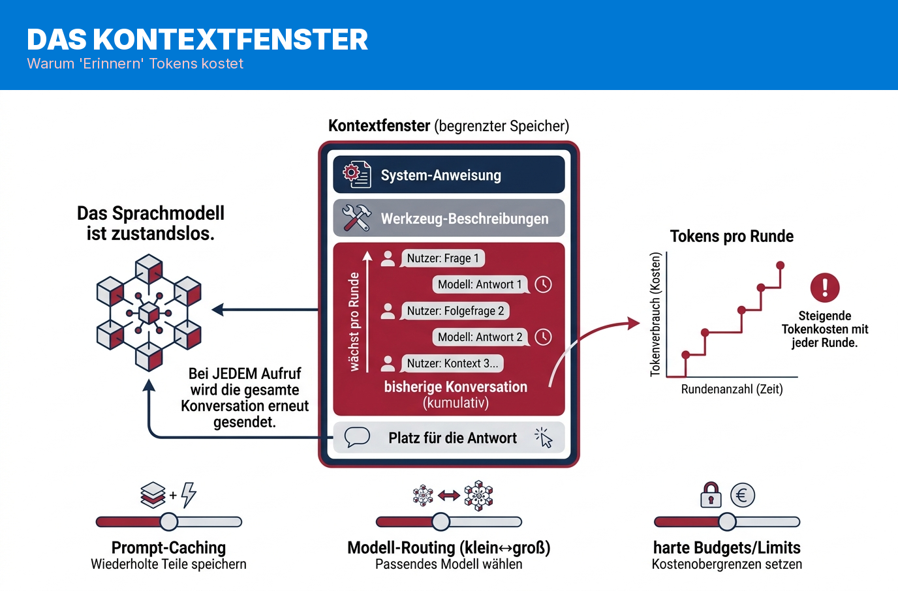

- das Modell ist **zustandslos** — die ganze Konversation wird bei *jedem* Aufruf erneut geschickt
- Prompt-Caching wirkt, weil identische Präfixe wiederverwendbar sind (KV-Cache)
- **Tokens wachsen pro Runde → Stufe 8 kostet ein Vielfaches von Stufe 2**

> Speaker: Das ist die Wurzel der Kostenkurve. „Lost in the middle": mehr Kontext ist nicht automatisch besser — ein Grund für frische Kontexte pro Rolle.

---

# Tools — wer führt aus?

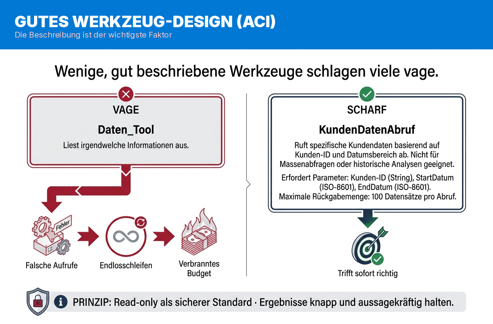

- das Modell **führt das Tool nicht selbst aus** — es gibt `tool_use` (JSON) zurück
- der **Host** führt aus und liefert `tool_result` → das ist die **Vertrauensgrenze**
- eine gute Tool-Beschreibung (ACI) ist der **wichtigste Einzelfaktor**

> Speaker: Wichtig für die Security-Leute: das Modell bittet, der Host handelt. Vage Tools = Fehlaufrufe, Endlosschleifen, verbranntes Budget.

---

# MCP — der Standard-Stecker

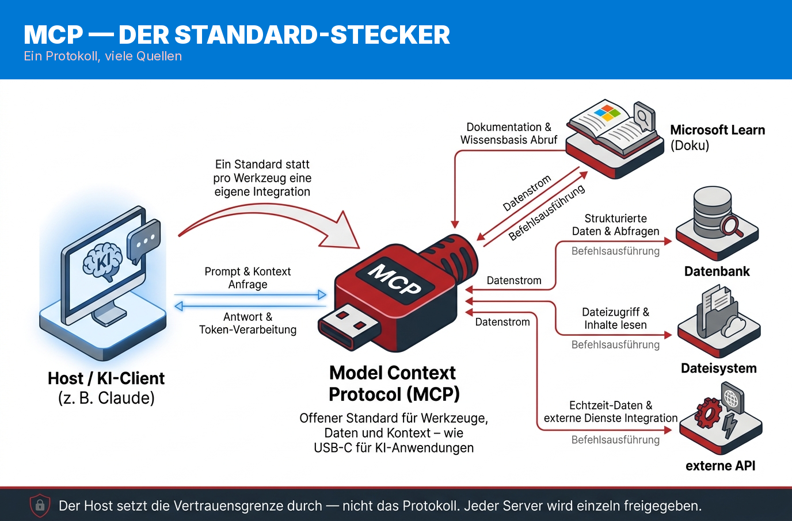

- konkret: der **Microsoft-Learn-MCP** liefert echte, aktuelle Doku statt Trainingswissen
- offener Standard: ein Protokoll, viele Quellen
- **Sicherheit:** der Host setzt die Trust-Boundary durch; Tool-Poisoning / Prompt-Injection sind reale Risiken

> Speaker: „USB-C für KI-Tools" — aber zuerst das echte Beispiel zeigen, dann die Analogie. Jeder Server wird einzeln freigegeben.

---

# Der Agent-Loop

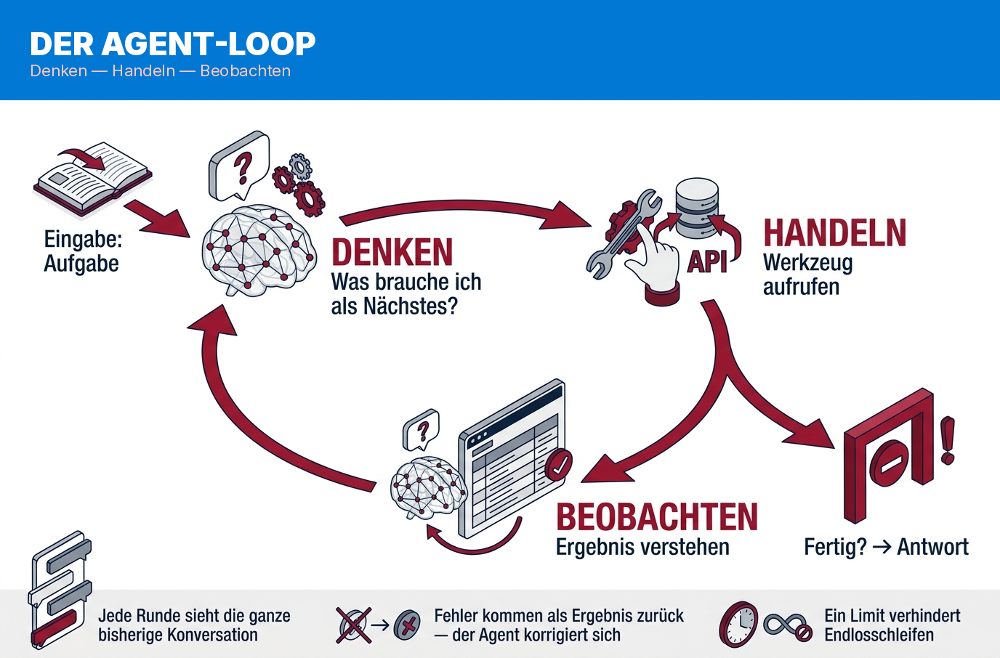

- Agent = LLM + Tools + **Schleife**: denken → handeln → beobachten
- läuft, solange das Modell ein Tool ruft (`tool_use`), endet bei `end_turn`
- Fehler kommen als Ergebnis zurück → Selbstkorrektur; ein **Limit** stoppt Endlosschleifen

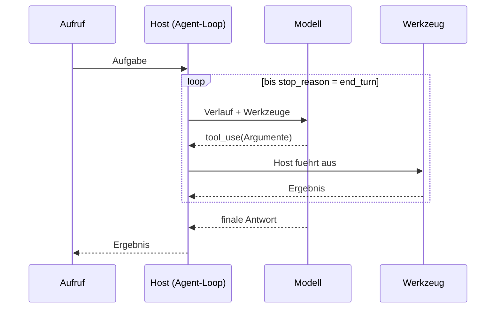

> Speaker: Das ist die ganze „Magie". Eine Schleife. Der Rest der Stufen ist nur mehr Struktur drumherum.

---

# Multi-Agent — Rollen statt einer Stimme

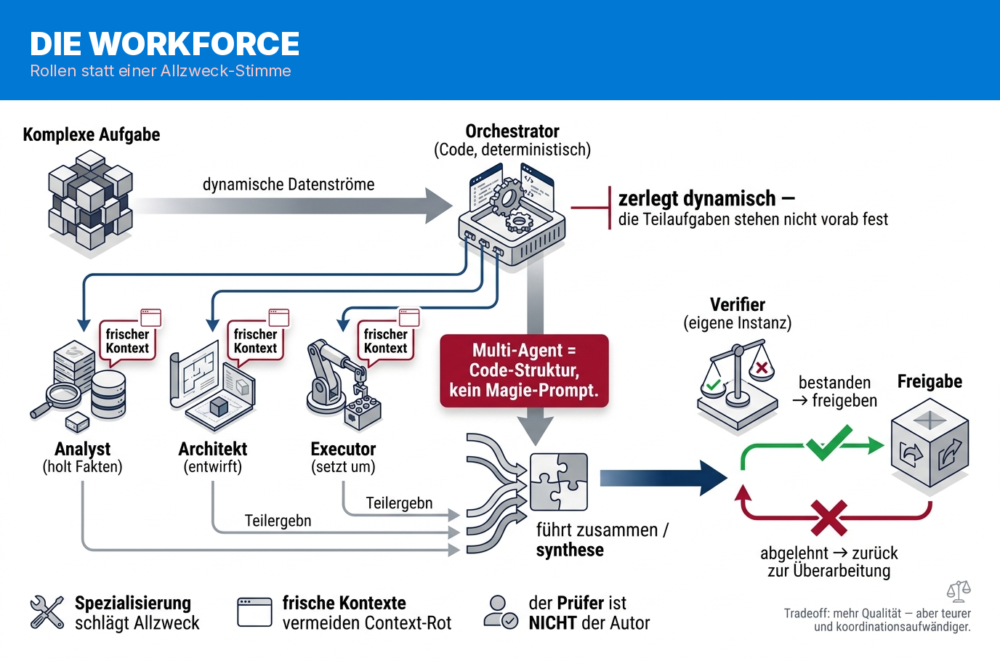

- spezialisierte Rollen, **in Code orchestriert** (nicht im Prompt versteckt)
- Analyst → Architekt → **Critic** (prüft unabhängig) → Executor
- der Critic findet **Design**-Schwächen — gegen **Fakten**-Halluzination braucht es harte Checks

> Speaker: „Multi-Agent = Code-Struktur." Und ehrlich: der Critic ist dasselbe Modell, kann selbst irren. Deshalb kommt gleich Verifizierung.

---

# Autonomie mit Grenzen

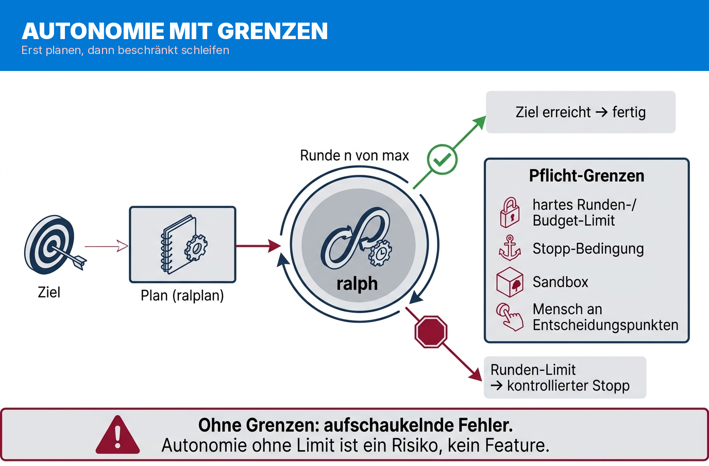

- erst planen (**ralplan**), dann eine **beschränkte** Schleife (**ralph**)
- Pflicht-Grenzen: Iterations-/Budget-Limit, Stopp-Bedingung, Sandbox, nur `validate` (nie `apply`)
- ohne Grenzen: **aufschaukelnde Fehler**

> Speaker: Autonomie ohne Limit ist ein Risiko, kein Feature. Die Demo läuft in isoliertem Config — das ist ein vorzeigbares Guardrail.

---

# Plan vs. Umsetzung — ralplan denkt, ralph handelt

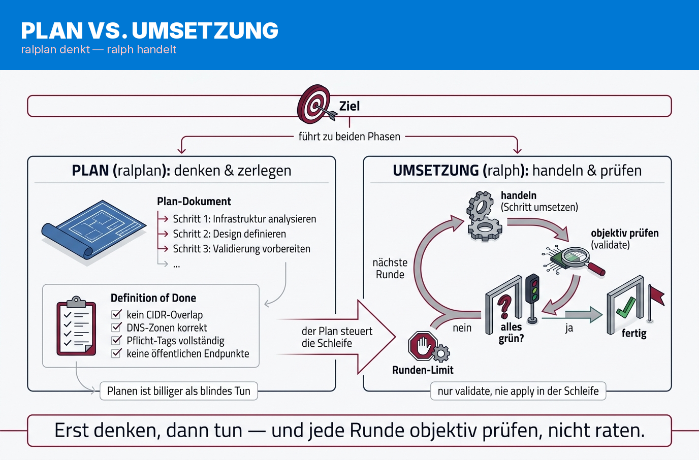

- **ralplan (Plan):** das Ziel in **Schritte + Definition of Done** zerlegen — *bevor* gehandelt wird
- **ralph (Umsetzung):** beschränkte Schleife — jede Runde **handeln → objektiv prüfen** (`validate`, nie `apply`)
- erst denken, dann tun — und jede Runde **messen, nicht raten**

> Speaker: Die Reife-Stufe von Autonomie. Planen ist billiger als blindes Tun; die Schleife prüft sich jede Runde selbst gegen die Definition of Done.

---

# Verifizierung — grün/rot statt „sieht gut aus"

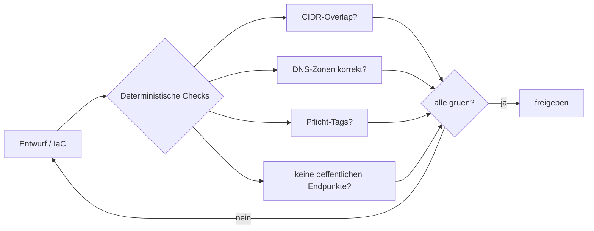

- Qualität wird **gemessen**, nicht behauptet
- **Halluzination heilt man nicht mit mehr Agenten**, sondern mit einem Check *außerhalb* des LLM

> Speaker: Das ist der Konzept-Anker, auf den die ganze Leiter hinausläuft. Woran erkennt man „besser"? An bestandenen Checks.

---

# Teil B — Acht Methoden an EINER Aufgabe

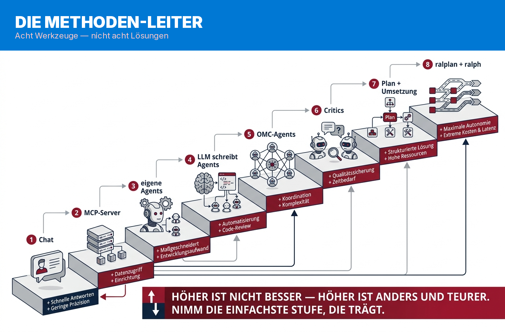

- keine Rangliste, keine Pipeline — **dieselbe Aufgabe, reifere Methode**
- Anker: aus `AUSGANGSLAGE.md` (Helvetia MedTech) die Netzwerk-Architektur entwickeln
- über die Stufen mitschneiden: **Tokens/Kosten** und **bestandene Checks**

> Speaker: Hier kommt die Ehrlichkeit. Stufe 3 ist ein bewusstes Tal. Der echte Sprung ist 4→5 (ein Agent → Rollen-Pipeline).

---

# Die acht Stufen

| # | Methode | Was sie zeigt |
|---|---|---|
| 1 | Chat | schneller Entwurf — für viele Skizzen genug |
| 2 | MCP | echte Doku → belegtes Wissen (*viele enden hier*) |
| 3 | eigene Agents | **bewusstes Tal**: vage Definition → beliebig |
| 4 | LLM schreibt Agents | Definition schärfen (menschlicher Blick nötig) |
| 5 | OMC-Agents | **ein Agent → Rollen-Pipeline** |
| 6 | Critics | unabhängige Prüfung findet Design-Schwächen |
| 7 | Plan + Umsetzung | IaC + objektive Validierung |
| 8 | ralplan + ralph | beschränkte Autonomie bis „grün" |

> Speaker: Live je Stufe ein kurzer Moment im Repo (01-chat … 08-ralplan-ralph). Nicht alle live ausführen — die teuren als Recording.

---

# Teil C — Das gebaute Ergebnis

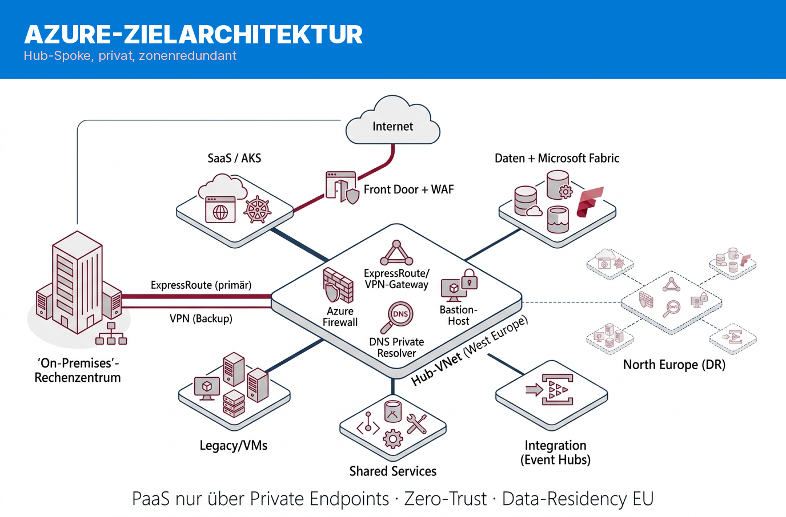

- Hub-Spoke (WEU primär, NEU für DR), zentrale Konnektivität, strikt private PaaS
- AKS / APIM / **Microsoft Fabric Capacity**, kontrollierter Ingress/Egress
- Zero-Trust + Data-Residency — by design

> Speaker: Das ist der Payoff: keine Folie voll Behauptungen, sondern eine geprüfte Architektur.

---

# Zero-Trust & Private Connectivity

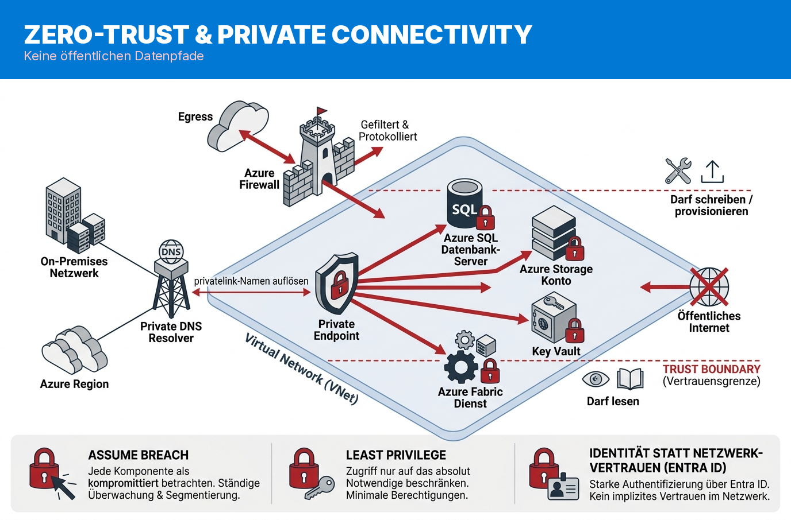

- PaaS nur über **Private Endpoints**, Auflösung über **Private DNS**
- Egress kontrolliert über Azure Firewall
- read-only/privat ist **Architektur, kein Nachgedanke**

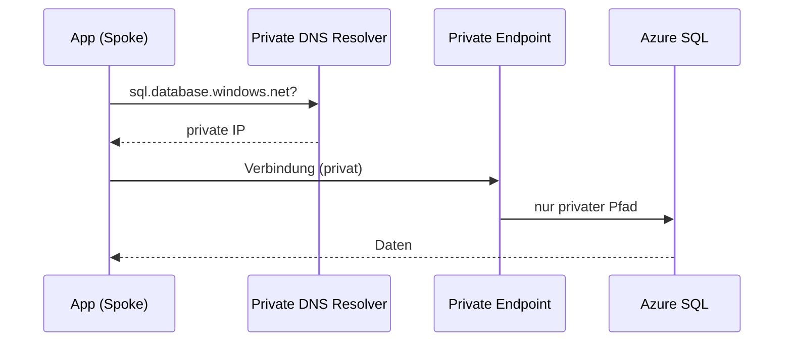

> Speaker: Für die Fabric/Daten-Leute: keine öffentlichen Datenpfade. Das ist die Microsoft-Techniker-Folie.

---

# Welche Stufe wann? (inkl. „kein Agent")

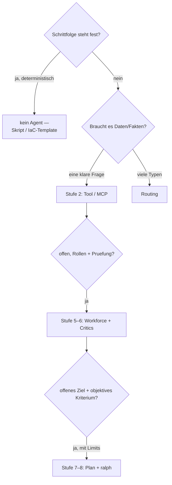

- **Deterministisch + geschlossen → gar kein Agent.** Skript/IaC schlägt jeden Agenten.
- „Architekt + ChatGPT" *ist* Stufe 1–2 — reicht für ~70 % der Skizzen.

> Speaker: Die wichtigste praktische Folie. Sie immunisiert gegen den „alles ist ein Agent"-Vorwurf.

---

# Mitnehmen

1. Versteh die Schichten: LLM → Tools/MCP → Agent → Multi-Agent → **Verifizierung** → Autonomie
2. Jede Stufe hat einen Preis — **die meisten Aufgaben enden auf Stufe 2–3**
3. Wert entsteht an **offenen, prüfintensiven** Aufgaben — und nur, wenn Qualität **gemessen** wird
4. Autonomie braucht Grenzen: Plan, Limit, Sandbox, objektives Abbruchkriterium
5. Manchmal ist die beste „KI-Architektur" ein **deterministisches Skript**

> Speaker: Fünf Sätze. Repo teilen (github TheTrustedAdvisor). Schlussfrage: „Welche eurer Aufgaben ist eine Stufe zu hoch gebaut?"

---

# Danke!

**Matthias Falland** — Microsoft Data Platform MVP
LinkedIn: matthias-falland · YouTube: @TheTrustedAdvisor · copilot-cockpit.com

> Speaker: Q&A. Repo + Ausgangslage zum Mitnehmen und Selber-Bauen.
