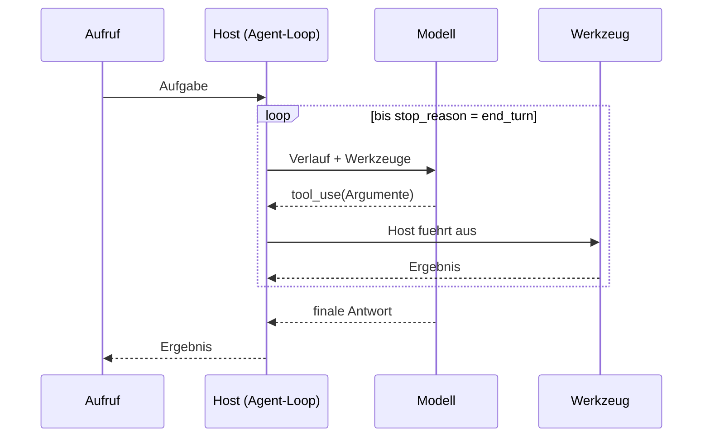
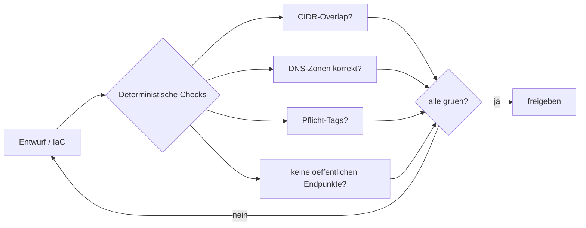
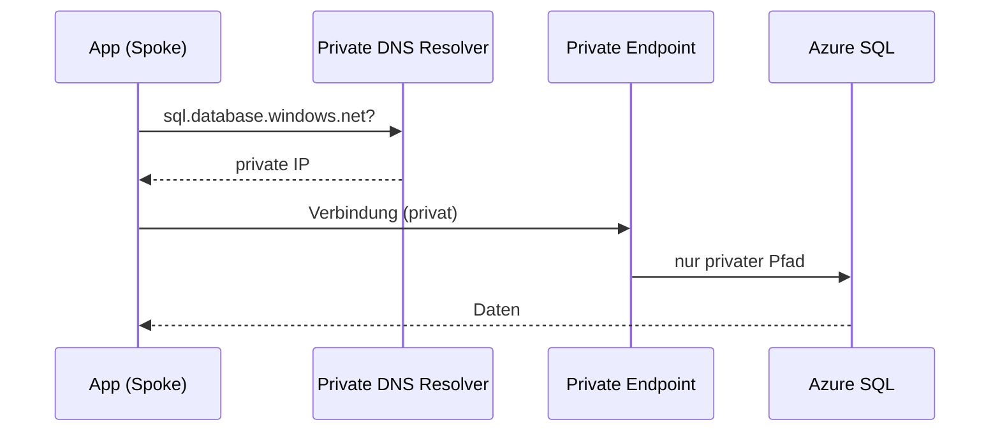
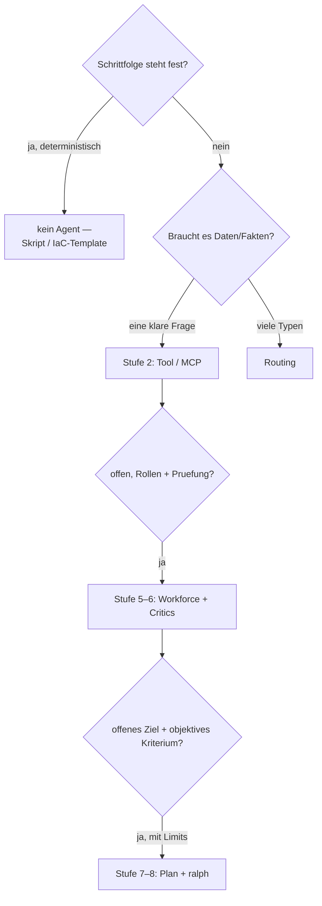

<!--
BUILD-ANWEISUNG FÜR DAS CLAUDE-POWERPOINT-ADDIN
================================================
Dies ist KEIN Vortragsskript, sondern eine Bauanleitung. Erzeuge daraus die Folien.

WIE LESEN
- Jeder mit `---` getrennte Block ist EINE Folie. Die `#`-Zeile ist der Folientitel.
- **Layout:** sagt, wie die Folie aufgebaut wird (Asset-Platzierung + Textzone).
- **Asset:** Pfad zum Bild (relativ zu dieser Datei). Bilder sind 16:9 und tragen den Marken-Header.
- ```mermaid```-Blöcke als Diagramm rendern.
- **Auf der Folie:** ist der EINZIGE Text, der auf die Folie kommt. Er ERGÄNZT das Asset
  (das „Warum"/der Trade-off) — er WIEDERHOLT NIE, was schon im Bild/Diagramm steht.
- Keine Sprechernotizen. Die Folien stehen für sich.

GESTALTUNG (global)
- Sprache: Deutsch. Stil: ruhig, technisch, viel Weissraum. Marke Matthias Falland (Rot/Navy).
- Standard-Layout für Bildfolien: Asset gross/formatfüllend; max. 3 kurze Ergänzungszeilen
  in einer schmalen Textspalte daneben (oder als schmales Band darunter). Keine vollen Sätze
  auf der Folie, wo ein Halbsatz reicht.
- Tabellen- und Diagramm-Folien: Asset zentriert, Ergänzungstext als kurzes Band darunter.
- WICHTIG: Die Infografiken tragen den Marken-Header BEREITS im Bild. Der Folien-Master darf
  auf Bildfolien KEINEN zweiten Header hinzufügen (sonst doppelt). Bei reinen Mermaid-/Text-/
  Tabellenfolien setzt der Master den Header normal.
-->

# Agentic Architecture
## From Chat to ralph

**Layout:** Titelfolie. Grosser Titel + Untertitel, darunter Referent + Event. Kein Asset.

**Auf der Folie:**
- **Matthias Falland** — Microsoft Data Platform MVP
- Techconference Wien 2026 · Workshop · Level 200–300

---

# Wer bin ich

**Layout:** Textfolie (kein Asset). Name als Headline, darunter 4 Belegzeilen. Platz für Porträt rechts (optional, falls vorhanden).

**Auf der Folie:**
- Microsoft **MVP Data Platform** (seit 2018) · **MCT** seit 2009
- **20 Jahre** Microsoft Data Platform: SQL Server 2005 → **Microsoft Fabric** 2025
- **20+ Enterprise-Implementierungen** — Architektur-Patterns aus der Praxis
- **Fabric Influencers Spotlight** (2025) · **FABCON 2026** Speaker · Fabric Friday @TheTrustedAdvisor

---

# Der rote Faden

**Layout:** Textfolie (kein Asset). Leitsatz oben gross hervorgehoben, darunter 3 Zeilen Aufbau.

**Auf der Folie:**
- Leitfrage des Tages: **nicht „wie hoch klettere ich", sondern „welche Stufe verlangt die Aufgabe".**
- Erst **erklären** (LLM → MCP → Agent → Multi-Agent → Verifizierung → Autonomie), dann an EINER echten Azure-Aufgabe **zeigen**.
- Auch das gehört dazu: **wann gar kein Agent** die beste Antwort ist.

---

# Mitmachen — Repo & Setup

**Layout:** Split. QR-Code gross links/zentral, Repo-URL als grosse Zeile, Code-Block rechts/darunter.

**Asset:** qr-repo.png

**Auf der Folie:**
- **github.com/TheTrustedAdvisor/agentic-azure-techconf-wien-2026** — öffentlich, alles zum Mitnehmen
- Jetzt scannen & klonen — das Setup läuft, während wir die Grundlagen machen.
- **Windows:** vorher `wsl --install`, dann in WSL/Ubuntu arbeiten (Details im Repo).

```bash
git clone https://github.com/TheTrustedAdvisor/agentic-azure-techconf-wien-2026
cd agentic-azure-techconf-wien-2026
./setup.sh                 # einmal: isoliertes Config + Login
cd 01-chat && ./run.sh     # los geht's
```

---

# Teil A — Grundlagen

**Layout:** Abschnitts-Trenner. Grosser Titel auf ruhigem Hintergrund, eine Zeile Untertitel. Kein Asset.

**Auf der Folie:**
- Sieben Konzept-Folien — dieselbe Mechanik für alle im Kopf, bevor wir bauen.

---

# Was ist ein LLM?

**Layout:** Bild formatfüllend, 3 Ergänzungszeilen in schmaler Spalte daneben.

**Asset:** infographics/01-llm-anatomie.png

**Auf der Folie (ergänzt das Bild — die Anatomie steht schon dort):**
- Konsequenz fürs Bauen: **plausibel ≠ korrekt** — kein Defekt, sondern die Arbeitsweise.
- Grounding (MCP, RAG) **senkt** Halluzination, **beseitigt** sie nicht.
- Merker für später: Korrektheit braucht einen Check **ausserhalb** des Modells.

---

# Kontext & Tokens

**Layout:** Bild formatfüllend, 3 Ergänzungszeilen daneben.

**Asset:** infographics/02-kontextfenster.png

**Auf der Folie (ergänzt das Bild — Zustandslosigkeit/Wachstum zeigt das Bild bereits):**
- Das ist die **Wurzel der Kostenkurve**: Tokens wachsen pro Runde → Stufe 8 kostet ein Vielfaches von Stufe 2.
- Prompt-Caching wirkt nur, weil **identische Präfixe** (KV-Cache) wiederverwendbar sind.
- „Lost in the middle": mehr Kontext ≠ besser — ein Grund für **frische Kontexte pro Rolle**.

---

# Tools — wer führt aus?

**Layout:** Bild formatfüllend, 3 Ergänzungszeilen daneben.

**Asset:** infographics/03-tool-use-aci.png

**Auf der Folie (ergänzt das Bild — den ACI-Ablauf zeigt das Bild bereits):**
- Sicherheitskern: **das Modell bittet (`tool_use`), der Host handelt** — dort liegt die Vertrauensgrenze.
- Die **Tool-Beschreibung** ist der wichtigste Einzelfaktor — nicht das Modell.
- Vage Tools = Fehlaufrufe, Endlosschleifen, verbranntes Budget.

---

# MCP — der Standard-Stecker

**Layout:** Bild formatfüllend, 3 Ergänzungszeilen daneben.

**Asset:** infographics/04-mcp-usb-c.png

**Auf der Folie (ergänzt das Bild — die USB-C-Analogie trägt das Bild):**
- Konkret heute: der **Microsoft-Learn-MCP** liefert echte, aktuelle Doku statt Trainingswissen.
- Drei typisierte Primitive (Tools/Resources/Prompts) über **JSON-RPC** — kein „Kabel".
- Risiko real: **Tool-Poisoning / Prompt-Injection** — der Host setzt die Vertrauensgrenze durch, jeder Server wird einzeln freigegeben.

---

# Der Agent-Loop

**Layout:** Bild oben formatfüllend (obere ~55 % der Fläche), Mermaid-Sequenz darunter (untere ~45 %), 2 Ergänzungszeilen als schmales Band ganz unten. Falls es eng wird: nur das Mermaid zeigen, Bild weglassen (das Diagramm trägt die Mechanik).

**Asset:** infographics/05-agent-loop.png



**Auf der Folie (ergänzt Bild + Diagramm):**
- Die ganze „Magie" ist **eine Schleife** — alle weiteren Stufen sind nur Struktur drumherum.
- Fehler kommen als Ergebnis zurück → **Selbstkorrektur**; ein **Limit** stoppt Endlosschleifen.

---

# Multi-Agent — Rollen statt einer Stimme

**Layout:** Bild formatfüllend, 3 Ergänzungszeilen daneben.

**Asset:** infographics/06-multi-agent-workforce.png

**Auf der Folie (ergänzt das Bild — die Rollen/Workforce zeigt das Bild):**
- Entscheidend: **in Code orchestriert**, nicht im Prompt versteckt.
- Der Critic findet **Design**-Schwächen — ist aber dasselbe Modell und kann selbst irren.
- Genau deshalb folgt als Nächstes **Verifizierung** — ein Check, der *nicht* wieder dasselbe Modell ist.

---

# Das Modell ist ein Spiegel

**Layout:** Bild formatfüllend, 3 Ergänzungszeilen daneben. *(Asset gitignored — vor dem Bauen von Hand einpflegen.)*

**Asset:** infographics/13-spiegel.png

**Auf der Folie (ergänzt das Bild — die Spiegel-Mechanik zeigt das Bild):**
- Mehr Agenten heilen keine Bestätigungstendenz — **dasselbe Modell spiegelt nur lauter**.
- Die Gefälligkeit ist kein Fehler, sondern Trainingsziel: nützlich **und** riskant.
- Deshalb ist der nächste Schritt kein besseres Modell, sondern ein **Kriterium ausserhalb** davon.

---

# Verifizierung — grün/rot statt „sieht gut aus"

**Layout:** Mermaid-Diagramm zentriert/gross, 2 Ergänzungszeilen als Band darunter. Kein Bild-Asset.



**Auf der Folie (ergänzt das Diagramm):**
- Der **Konzept-Anker** der ganzen Leiter: „besser" = **bestandene Checks**, nicht „sieht gut aus".
- **Halluzination heilt man nicht mit mehr Agenten**, sondern mit einem Check *ausserhalb* des LLM.

---

# Autonomie mit Grenzen

**Layout:** Bild formatfüllend, 3 Ergänzungszeilen daneben.

**Asset:** infographics/07-autonomie-grenzen.png

**Auf der Folie (ergänzt das Bild — Plan→beschränkte Schleife zeigt das Bild):**
- Autonomie ohne Limit ist ein **Risiko, kein Feature** — ohne Grenzen schaukeln Fehler auf.
- Pflicht-Grenzen: Iterations-/Budget-Limit, Stopp-Bedingung, Sandbox, nur `what-if`/`validate` (nie `apply`).
- Vorzeigbares Guardrail in der Demo: die Stufen laufen in **isoliertem `.claude-demo/`** (eigenes Config).

---

# Plan vs. Umsetzung — ralplan denkt, ralph handelt

**Layout:** Bild formatfüllend (zwei Panels), 2 Ergänzungszeilen als Band darunter.

**Asset:** infographics/08-plan-umsetzung.png

**Auf der Folie (ergänzt das Bild — die zwei Phasen zeigt das Bild):**
- **Planen ist billiger als blindes Tun** — das Ziel wird erst in Schritte + Definition of Done zerlegt.
- Jede Schleifenrunde **misst gegen die Definition of Done**, statt zu raten.

---

# Erst die Werkbank, dann das Werk

**Layout:** Bild formatfüllend, 3 Ergänzungszeilen daneben. *(Asset gitignored — vor dem Bauen von Hand einpflegen.)*

**Asset:** infographics/12-werkbank.png

**Auf der Folie (ergänzt das Bild — die drei Bewegungen RÜSTEN→PLAN→UMSETZEN zeigt das Bild):**
- Die teuerste Stufe ist wertlos, wenn das Ziel unscharf ist — **erst die Definition of Done, dann die Methode**.
- „Welche Werkzeuge?" ist die Stufenfrage; „Was genau?" ist die Qualitätsfrage — **die zweite entscheidet**.
- Ein scharfes Ziel macht **jede** der acht Stufen besser.

---

# Teil B — Acht Methoden, live an EINER Aufgabe

**Layout:** Bild formatfüllend, 3 Ergänzungszeilen daneben.

**Asset:** infographics/09-methoden-leiter.png

**Auf der Folie (ergänzt das Bild — die Leiter mit den Achsen zeigt das Bild):**
- **Keine Rangliste, keine Pipeline** — dieselbe Aufgabe, reifere Methode.
- Anker: aus `AUSGANGSLAGE.md` (Helvetia MedTech) die Netzwerk-Architektur entwickeln — **live** je Stufe ein Repo-Ordner (`01-chat` … `08-ralplan-ralph`).
- Stufe 3 ist ein **bewusstes Tal**; der echte Sprung ist **4→5** (ein Agent → Rollen-Pipeline).

---

# Die acht Stufen

**Layout:** Tabellenfolie (kein Asset). Tabelle gross, eine Ergänzungszeile darunter.

| # | Methode | Was sie zeigt |
|---|---|---|
| 1 | Chat | schneller Entwurf — für viele Skizzen genug |
| 2 | MCP | echte Doku → belegtes Wissen (*viele enden hier*) |
| 3 | eigene Agents | **bewusstes Tal**: vage Definition → beliebig |
| 4 | LLM schreibt Agents | Definition schärfen (menschlicher Blick nötig) |
| 5 | OMC-Agents (vorgefertigte Rollen-Agents) | **ein Agent → Rollen-Pipeline** |
| 6 | Critics | unabhängige Prüfung findet Design-Schwächen |
| 7 | Plan + Umsetzung | IaC + objektive Validierung |
| 8 | ralplan + ralph | beschränkte Autonomie bis „grün" |

**Auf der Folie:**
- Im Repo je Stufe ein eigener Ordner (`01-chat` … `08-ralplan-ralph`) — selbst nachbaubar.

---

# Teil C — Das gebaute Ergebnis

**Layout:** Bild formatfüllend, 3 Ergänzungszeilen daneben.

**Asset:** infographics/10-azure-zielarchitektur.png

**Auf der Folie (ergänzt das Bild — die Hub-Spoke-Topologie zeigt das Bild):**
- Der Payoff: keine Folie voll **Behauptungen**, sondern eine **geprüfte** Architektur.
- WEU primär, NEU für DR; strikt private PaaS; kontrollierter Ingress/Egress.
- **Microsoft Fabric Capacity** als Datendienst — Zero-Trust + Data-Residency by design.

---

# Zero-Trust & Private Connectivity

**Layout:** Bild links (~55 % Breite), Mermaid-Sequenz rechts (~45 %), 2 Ergänzungszeilen als schmales Band unter beiden. Falls es eng wird: nur das Mermaid zeigen, Bild weglassen.

**Asset:** infographics/11-zero-trust-private.png



**Auf der Folie (ergänzt Bild + Sequenz):**
- **Keine öffentlichen Datenpfade** — PaaS nur über Private Endpoints, Auflösung über Private DNS.
- read-only/privat ist **Architektur, kein Nachgedanke** — die Folie für die Fabric/Daten-Leute.

---

# Welche Stufe wann? (inkl. „kein Agent")

**Layout:** Mermaid-Entscheidungsbaum zentriert/gross, 2 Ergänzungszeilen als Band darunter. Kein Bild-Asset.



**Auf der Folie (ergänzt den Baum):**
- Warum die oberste Frage zählt: ein Agent auf einer **deterministischen** Aufgabe addiert nur Tokens, Latenz und Nichtdeterminismus.
- „Architekt + ChatGPT" *ist* Stufe 1–2 — und deckt die **grosse Mehrheit** der Skizzen ab.

---

# Mitnehmen

**Layout:** Textfolie (kein Asset). Fünf nummerierte Kernsätze, grosszügig gesetzt.

**Auf der Folie:**
1. Versteh die Schichten: LLM → Tools/MCP → Agent → Multi-Agent → **Verifizierung** → Autonomie.
2. Jede Stufe hat einen Preis — **die meisten Aufgaben enden auf Stufe 2–3**.
3. Wert entsteht an **offenen, prüfintensiven** Aufgaben — und nur, wenn Qualität **gemessen** wird.
4. Autonomie braucht Grenzen: Plan, Limit, Sandbox, objektives Abbruchkriterium.
5. Manchmal ist die beste „KI-Architektur" ein **deterministisches Skript**.

---

# Danke!

**Layout:** Schlussfolie (kein Asset). Name gross, Kontaktzeile darunter.

**Auf der Folie:**
- **Matthias Falland** — Microsoft Data Platform MVP
- LinkedIn: matthias-falland · YouTube: @TheTrustedAdvisor · copilot-cockpit.com
- Repo + `AUSGANGSLAGE.md` zum Mitnehmen und Selber-Bauen.
