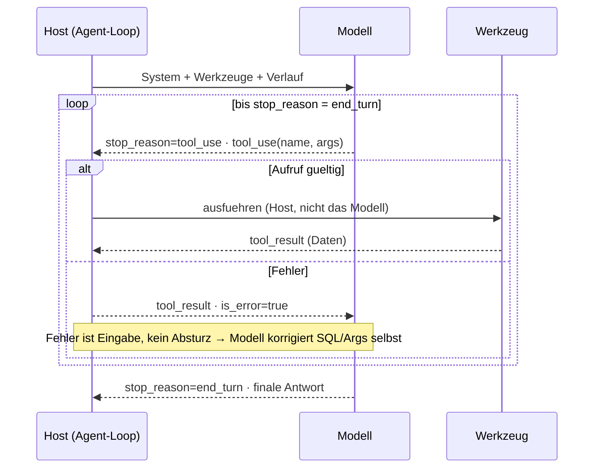
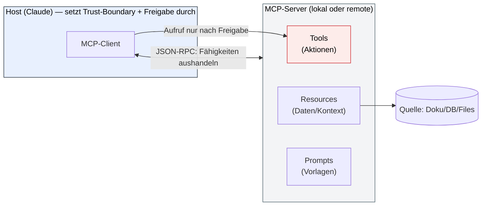
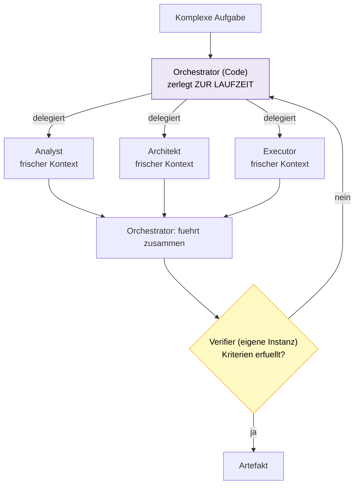
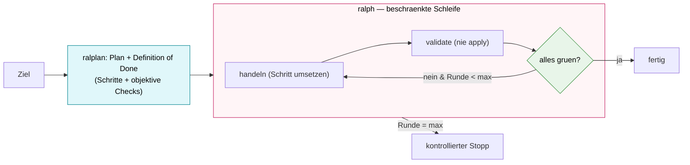
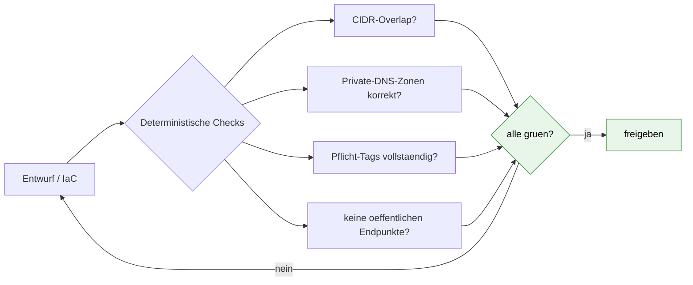
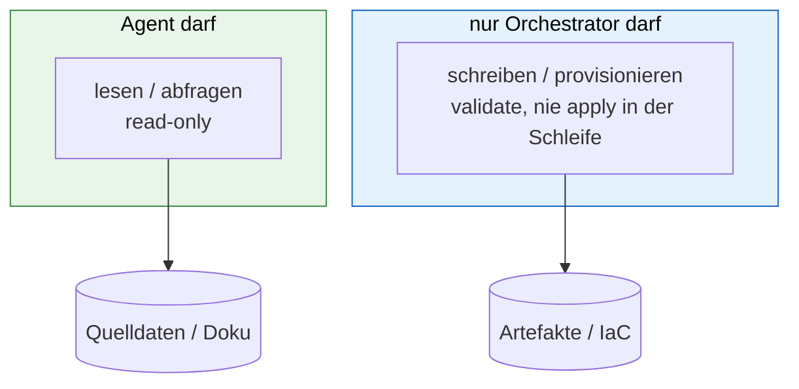
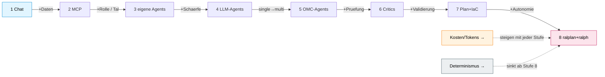
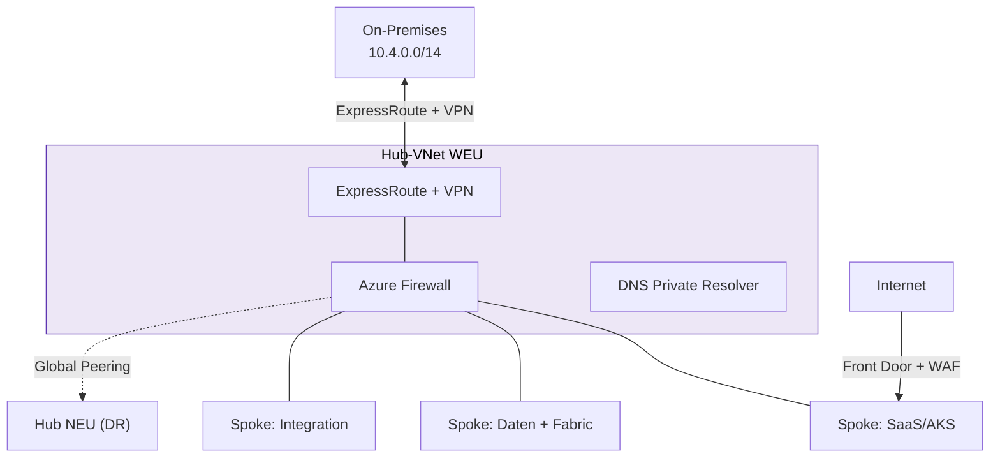
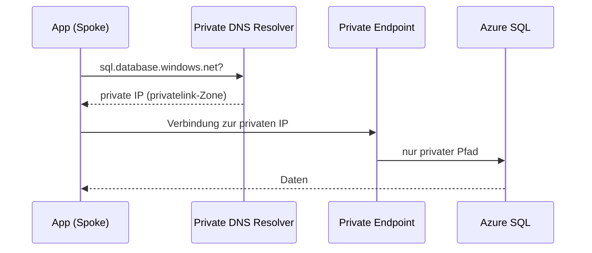
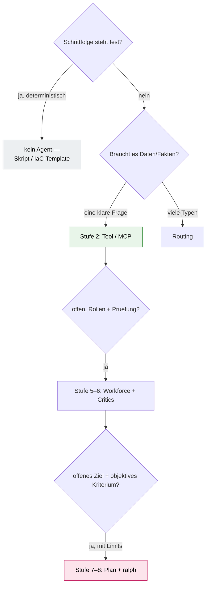

# Mermaid-Patterns (technisch + logisch)

> Technische Präzision zu den Infografiken — Mechanik, nicht Offensichtliches. Jeder Block einzeln
> nach mermaid.live → SVG/PNG (oder gerenderte PNGs in `images/`). Validiert mit `mmdc`.

## m-agent-loop — Loop mit Selbstkorrektur (das Nicht-Offensichtliche)

> Pointe: Fehler werden in den Loop *zurückgegeben* — Resilienz by design. Das Modell bittet, der Host handelt.

## m-mcp-architektur — MCP ist ein typisiertes Protokoll, kein Kabel

> Nicht „ein Stecker", sondern drei typisierte Primitive (Tools/Resources/Prompts) über JSON-RPC; der Host mediiert jeden Zugriff.

## m-multi-agent — Dynamische Zerlegung + Verifier-Schleife

> Teilaufgaben stehen *nicht* vorab fest; jeder Worker hat ein frisches Kontextfenster; der Prüfer ist nicht der Autor.

## m-plan-umsetzung — ralplan denkt, ralph handelt

> Planen (denken) und Umsetzen (handeln+prüfen) sind getrennte Phasen; jede Runde prüft objektiv, statt zu raten.

## m-eval-gate — Objektives Tor (grün/rot statt „sieht gut aus")

> Gegen *Fakten*-Halluzination hilft nur ein Check **außerhalb** des LLM.

## m-trust-boundary — read-only (Agent) vs. write (Orchestrator)

## m-methoden-leiter — Stufen mit zwei Achsen (Fähigkeit ↑, Determinismus ↓)

## m-azure-hubspoke — Hub-Spoke WEU + DR-NEU

## m-private-dns — Private Endpoint + Auflösung (hybrid)

## m-entscheidung — Welche Stufe wann (inkl. „kein Agent")

> Die meisten Aufgaben enden bei Stufe 2–3. „Architekt + ChatGPT" *ist* Stufe 1–2.
