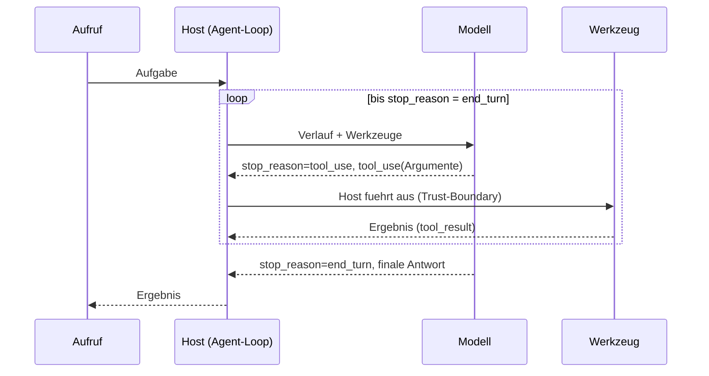
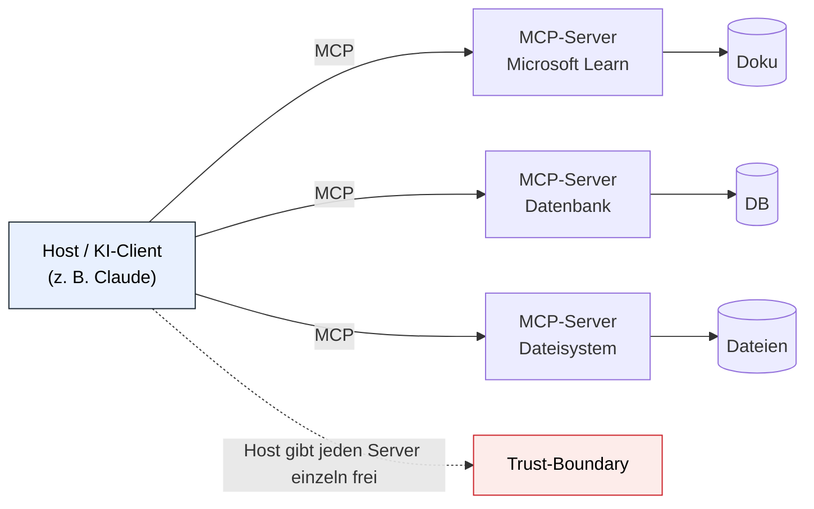
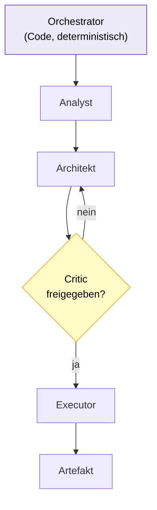
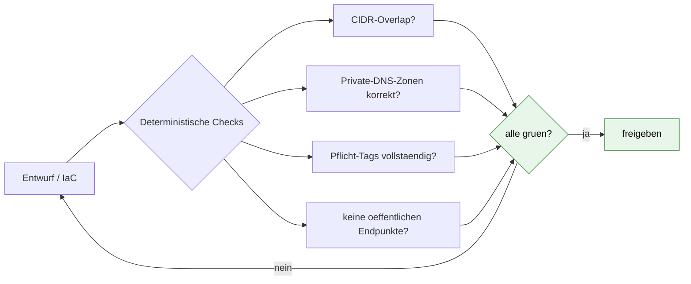
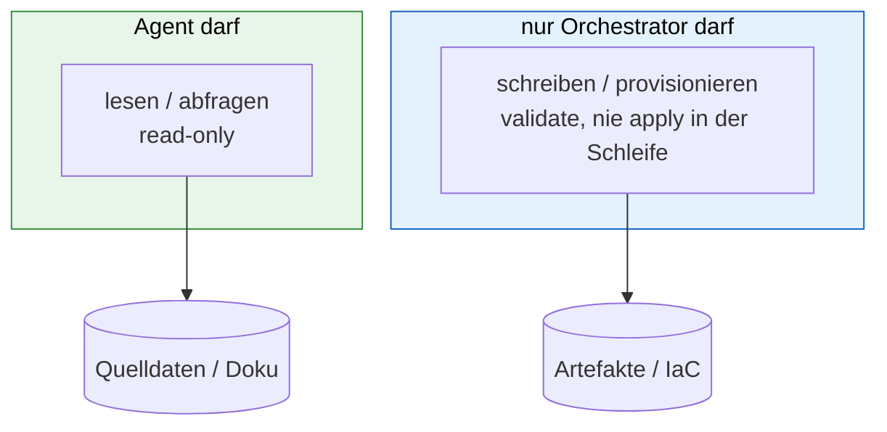
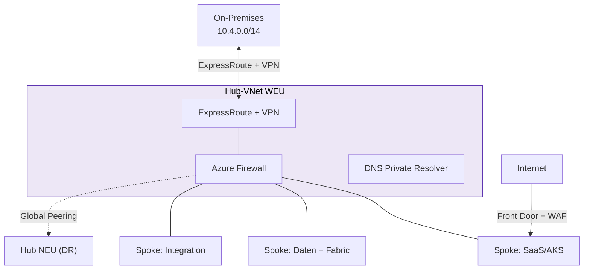
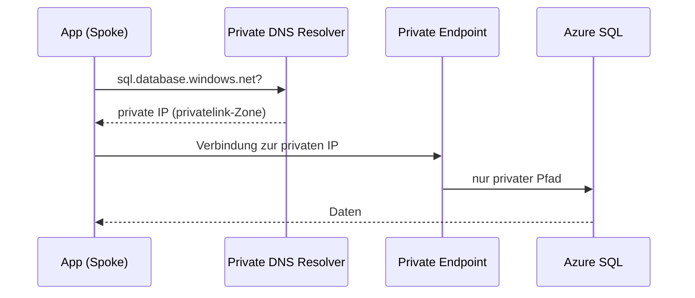
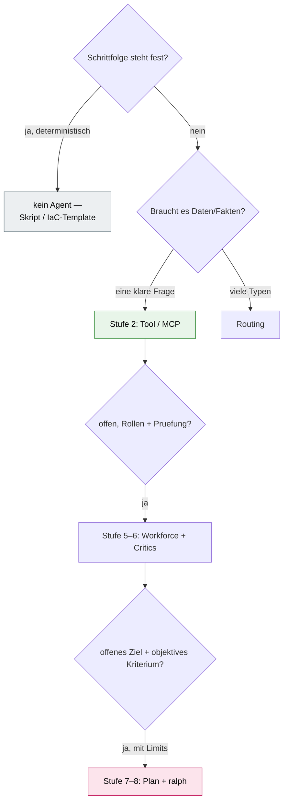

# Mermaid-Patterns (technisch + logisch)

> Technische Präzision zu den Infografiken. Jeder Block einzeln nach mermaid.live → SVG/PNG,
> oder inline im Präsentations-Markdown. Validiert mit `mmdc`.

## m-agent-loop — Der Agent-Loop (think → act → observe)

> Das Modell führt nichts selbst aus — es *bittet*, der Host *handelt*. Limit verhindert Endlosschleifen.

## m-mcp-architektur — MCP: ein Standard, viele Quellen

## m-multi-agent — Orchestrator + Rollen + Critic-Tor

## m-eval-gate — Objektives Tor (grün/rot statt „sieht gut aus")

> Gegen *Fakten*-Halluzination hilft nur ein Check **außerhalb** des LLM.

## m-trust-boundary — read-only (Agent) vs. write (Orchestrator)

## m-methoden-leiter — 8 Stufen mit Gewinn/Preis

```mermaid
flowchart LR
    S1["1 Chat"] -->|"+Daten / +Latenz"| S2["2 MCP"]
    S2 -->|"+Rolle / Tal"| S3["3 eigene Agents"]
    S3 -->|"+Schaerfe"| S4["4 LLM-Agents"]
    S4 -->|"single→multi"| S5["5 OMC-Agents"]
    S5 -->|"+Pruefung"| S6["6 Critics"]
    S6 -->|"+Validierung"| S7["7 Plan+IaC"]
    S7 -->|"+Autonomie/−Determinismus"| S8["8 ralplan+ralph"]
    style S1 fill:#e1f5ff,stroke:#0288d1,color:#000
    style S8 fill:#fce4ec,stroke:#c2185b,color:#000
```

## m-azure-hubspoke — Hub-Spoke WEU + DR-NEU

## m-private-dns — Private Endpoint + Auflösung (hybrid)

## m-entscheidung — Welche Stufe wann (inkl. „kein Agent")

> Die meisten Aufgaben enden bei Stufe 2–3. „Architekt + ChatGPT" *ist* Stufe 1–2.
